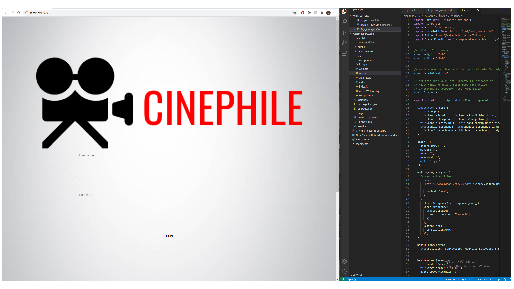
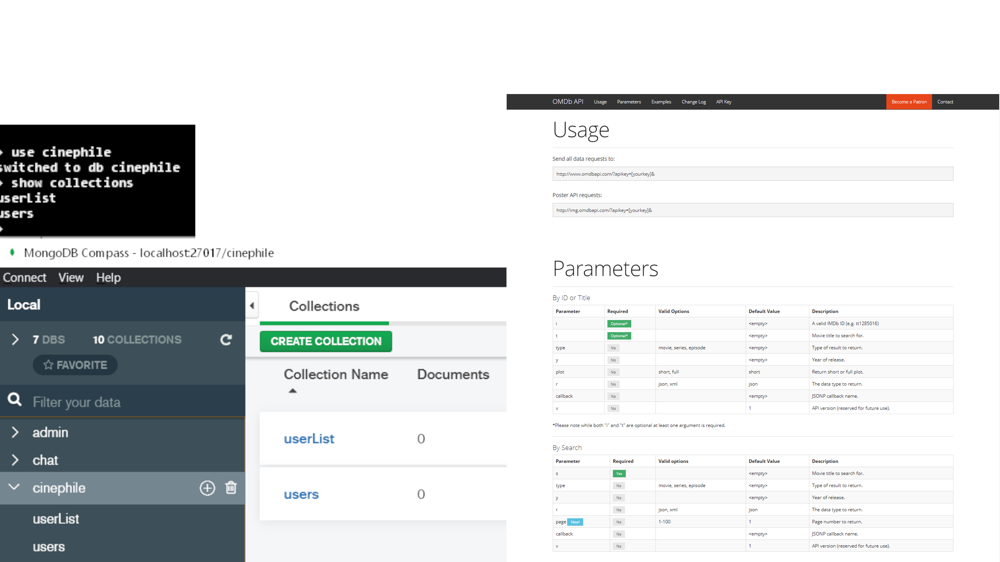
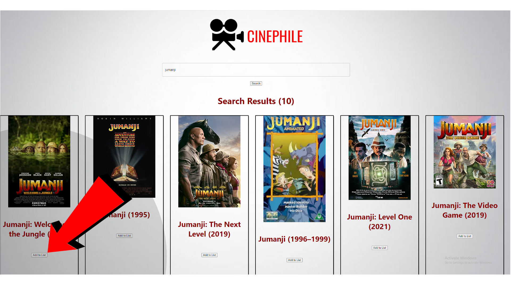
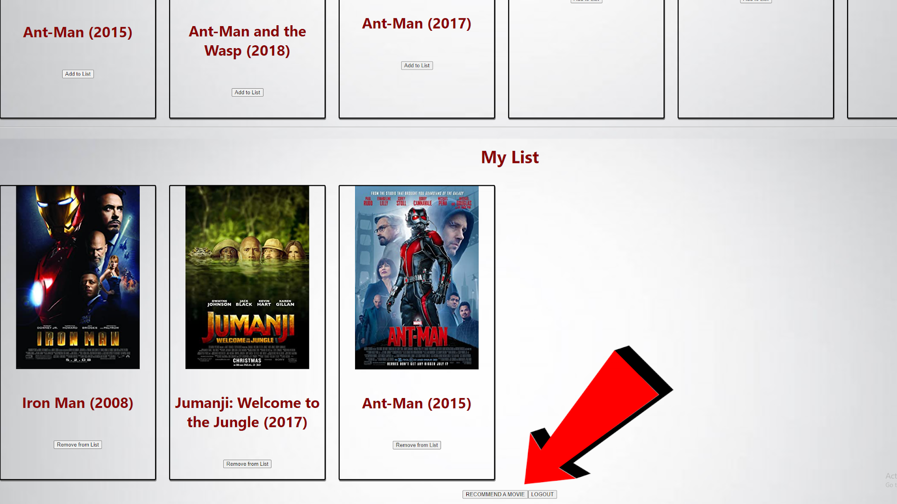
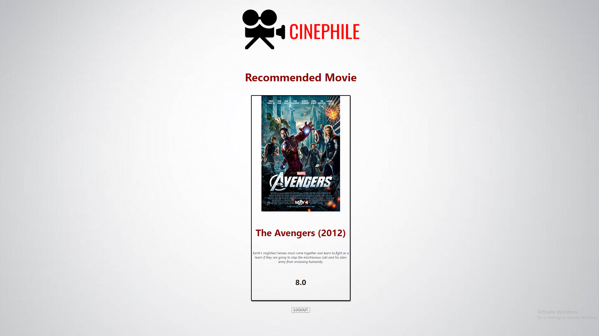
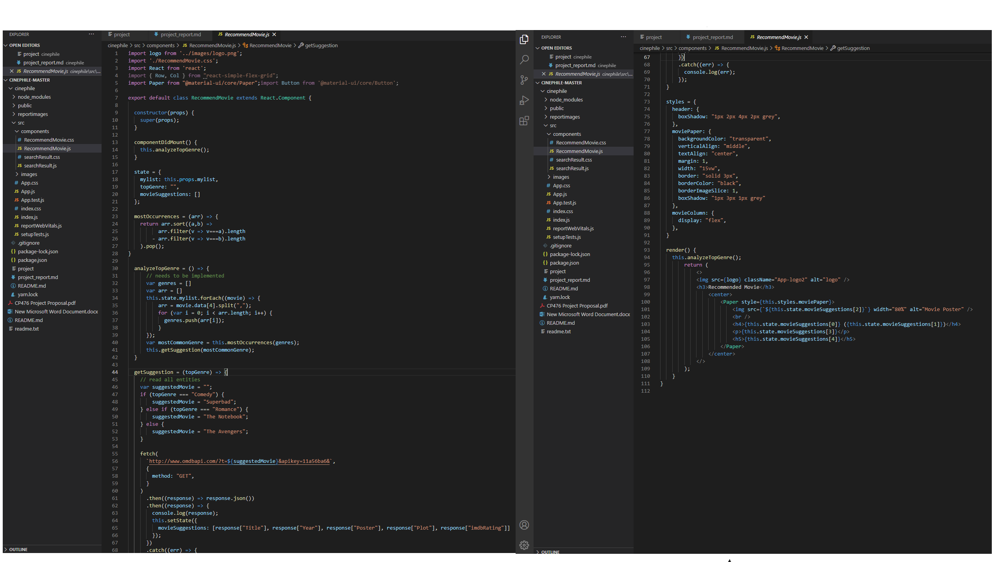
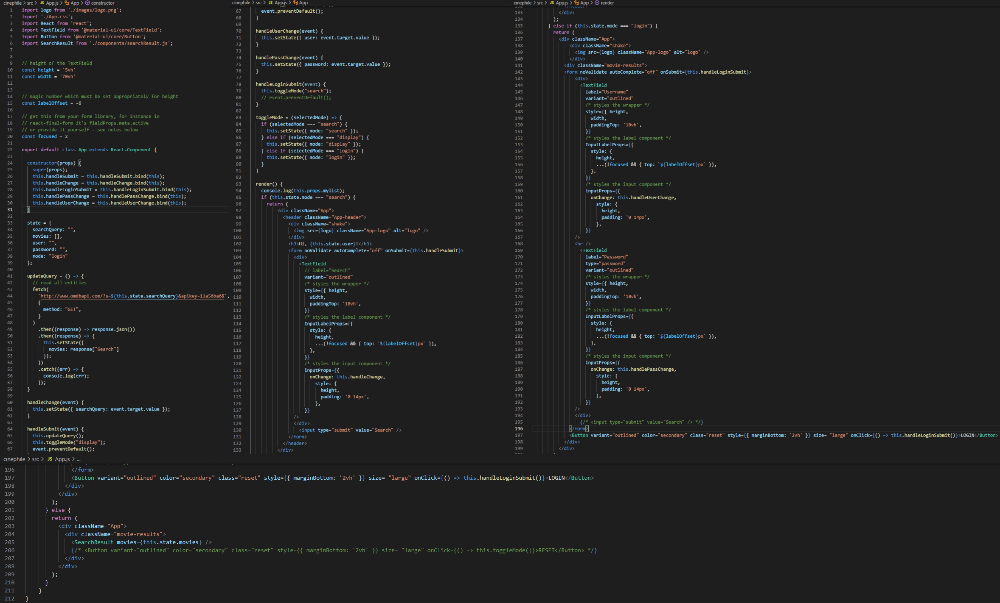
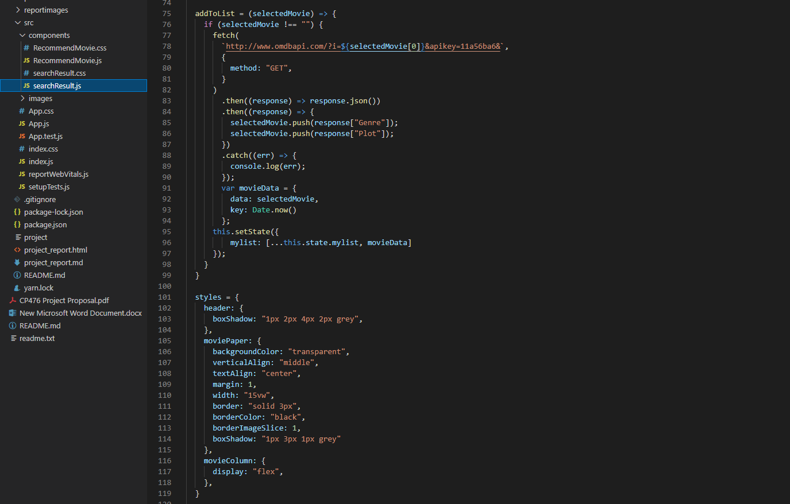

# Cinephile Project Report
# P2 System design & implementation

Authors: Arshdeep Sahi, Ireoluwatomiwa Oladele, Scott Peebles

Date: 2021-04-10

## P2.1 Client side component & UI

Complete (Yes/No)? Yes 

<!--
{width=600px}
-->

Client side UI and Part of the App.js code
 
## P2.2 Server side CGI components & P2.3 Database tier design, data, usage

Complete (Yes/No)? Yes
 

<!--
{width=600px}
-->

Showing database of userList, users as well as the usage and parameters for the OMDb APi
 
## P2.4 New features and tools

Complete (Yes/No)? Yes

<!--
{width=600px}
-->

User login

Searching tool

My list feature

Movie recommendation feature
 

## P2.5 Problem solving algorithms 

Complete (Yes/No)? Yes

<!--
{width=600px}
-->

Movie recommendation algorithm
 
## P2.6 Efficiency and robustness 

Complete (Yes/No)? Yes

<!--
{width=600px}
-->

Screenshot of App.js code and the add to list function. The app runs efficiently and results are loaded in secends.
Analyzing the top genre is O(n^2)
The rest of the code runs in O(n) or O(logn)
 

